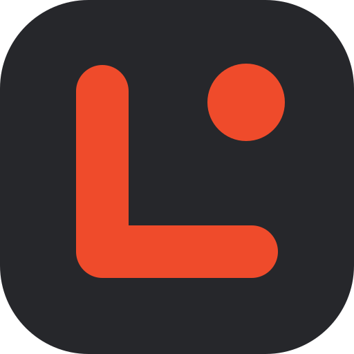
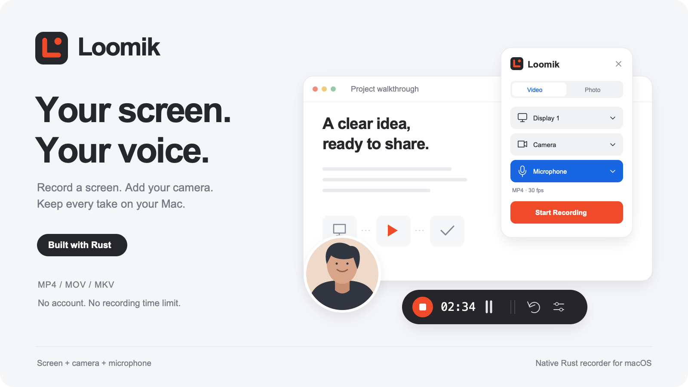

<p align="center">
  
</p>

<h1 align="center">Loomik</h1>

<p align="center">
  <strong>A native Rust recorder for your screen, media, camera, and voice.</strong><br>
  Floating controls. Local files. No account or recording time limit.
</p>

<p align="center">
  <a href="#downloads">Downloads</a> ·
  <a href="#what-you-can-do">Features</a> ·
  <a href="#platform-support">Platforms</a> ·
  <a href="#roadmap">Roadmap</a>
</p>

<p align="center">
  
</p>

Loomik helps you record a walkthrough, explain an idea, or demonstrate a bug
without setting up a full video studio. Choose a display, application window,
image, or video, add a camera and microphone if you need them, and save a movie on
your computer. Compact controls float above your work and stay out of the recording.

The project is written in **Rust**, with an **egui** interface, native capture
backends, and **FFmpeg** encoding. It has no account system, cloud storage, or uploads.
The graphic above is a product illustration using demo content.

## What you can do

- **Record a display or window** with optional cursor capture.
- **Record your camera only** as a full rectangular frame, with an optional
  microphone. No desktop capture or Screen Recording permission is needed.
- **Record over a photo or video** in Background studio, with canvas-relative
  camera placement, aspect ratios, Fit/Fill, seeking, looping, and audio levels.
  File backgrounds do not use desktop capture or need Screen Recording permission.
- **Use floating controls** to start, pause, resume, and stop; the timer shows
  recording time and excludes pauses. Settings and controls stay out of the video.
- **Move every floating window** by dragging its background, title, or camera image.
  A centered **3 → 2 → 1 → 0** countdown gives you time to get ready before recording.
- **Add your camera** as a circular overlay. Move, resize, or mirror it, and choose
  from connected cameras exposed by macOS.
- **Record your microphone** with capture timestamps aligned to the video timeline.
- **Export MP4, MOV, or MKV** with H.264 video and optional AAC audio, at 15/30/60 fps
  and resolutions up to 4K, subject to source dimensions and hardware performance.
- **Take PNG screenshots** with the same source selection and optional camera circle.
- **Keep recordings local** in a folder you choose. There is no application-imposed
  duration cap; available storage and hardware throughput are the practical limits.
- **Use hardware encoding when available**, with a software fallback, bounded media
  buffers, and recoverable recording fragments.

## Platform support

| Platform | Current status |
| --- | --- |
| macOS 13+ | Native CI for Apple Silicon and Intel; hardware capture verified on macOS 26.1 / Apple Silicon |
| Windows 11 x64 | Native MSVC CI and standalone package checks; WGC, camera and microphone hardware validation pending |
| Ubuntu 24.04 x86_64 | Native CI, `.deb` installation, GUI smoke and isolated X11 capture checks; Wayland and device hardware validation pending |

Hardware recording has been verified on **macOS**, including image/video backgrounds.
Windows has a native backend and a [build/verification guide](docs/windows.md).
Linux has a [build and capability guide](docs/linux.md); its initial safe mode captures
an individual window, with the camera positioned inside Recording studio.
Whole-monitor and cursor capture are unavailable on Linux. Build, media and package
checks run on native GitHub Actions runners; their scope is recorded in
[VERIFICATION.md](VERIFICATION.md). They do not replace physical device tests.
System/desktop audio is not captured.

## Downloads

Download **[Loomik 1.0.0](https://github.com/rafzei/Loomik/releases/tag/v1.0.0)**:

| System | Download |
| --- | --- |
| macOS 13+, Apple Silicon | [DMG](https://github.com/rafzei/Loomik/releases/download/v1.0.0/Loomik-1.0.0-macOS-arm64.dmg) · [ZIP](https://github.com/rafzei/Loomik/releases/download/v1.0.0/Loomik-1.0.0-macOS-arm64.zip) |
| macOS 13+, Intel | [DMG](https://github.com/rafzei/Loomik/releases/download/v1.0.0/Loomik-1.0.0-macOS-x86_64.dmg) · [ZIP](https://github.com/rafzei/Loomik/releases/download/v1.0.0/Loomik-1.0.0-macOS-x86_64.zip) |
| Windows 11, x64 | [ZIP](https://github.com/rafzei/Loomik/releases/download/v1.0.0/Loomik-1.0.0-Windows-x64.zip) |
| Ubuntu 24.04 LTS, amd64 | [DEB](https://github.com/rafzei/Loomik/releases/download/v1.0.0/Loomik-1.0.0-Ubuntu-24.04-amd64.deb) |

[SHA-256 checksums](https://github.com/rafzei/Loomik/releases/download/v1.0.0/SHA256SUMS)
are included with the release. macOS and Windows packages include FFmpeg/FFprobe.
Ubuntu installs its dependencies through APT.
Developer tools are only needed when building from source.

macOS builds are ad-hoc signed, not notarized; Windows builds are unsigned.
Hardware capture on macOS has been verified. Windows and Ubuntu camera,
microphone and compositor checks remain unverified; see
[Windows](docs/windows.md), [Ubuntu](docs/linux.md) and [verification](VERIFICATION.md).

## Build from source on macOS

Requires **macOS 13 or later**, Rust 1.88+, a current full Xcode installation
(CI selects the latest stable Xcode), and FFmpeg with `libx264`. The ScreenCaptureKit bindings
compile a Swift/Metal bridge that needs the current SDK; older Command Line
Tools alone may fail with missing Metal API members. Select the installed Xcode
with `sudo xcode-select --switch /Applications/Xcode.app/Contents/Developer`. Then:

```sh
git clone https://github.com/rafzei/Loomik.git
cd Loomik
brew install ffmpeg
bash scripts/bundle.sh
open "target/release/bundle/Loomik.app"
```

The build produces a locally signed application. You can copy it to Applications.
It is not Developer ID signed or notarized for distribution. Use the `.app` for
normal use so macOS can identify its screen, camera, and microphone permissions.
The FFmpeg locator handles Apple Silicon and Intel Homebrew paths, `PATH`, an
adjacent executable, and `LOOMIK_FFMPEG`. Video backgrounds also require FFprobe,
found beside FFmpeg, on `PATH`, or via `LOOMIK_FFPROBE`.

## Record

1. Choose **Allow Screen Recording** and enable Loomik in System Settings →
   Privacy & Security → Screen & System Audio Recording (called Screen Recording
   on older macOS releases). Relaunch if macOS requests it, then refresh sources.
   If macOS also shows a direct-screen-capture confirmation, allow it before
   recording your final take; visible system dialogs can appear in the video.
2. Choose a display or individual application window. A browser tab can be
   recorded by choosing its browser window; this native app does not integrate
   with browser tab selection APIs.
3. Optionally select a camera and microphone. macOS asks for each permission the
   first time you use it. Built-in, USB, and other AVFoundation video devices are
   listed, including supported Continuity cameras.
4. Drag the camera circle to position it. Hover over it to use **− / +**, scroll
   to resize, or use the Camera size slider in expanded settings. Mirroring is
   applied to both preview and saved video.
5. Click **Start Recording**. Once devices are ready, **3 → 2 → 1 → 0** appears
   in the center of the selected display (or the display containing most of the
   selected window). Zero stays visible for 0.3 seconds, then video and audio
   start together. **Esc**, **Cancel**, or the toolbar's Stop button cancels the
   countdown without saving a movie. The countdown stays out of the recording.
   The charcoal toolbar shows elapsed active time, Stop, Pause/Resume, Start over,
   Discard, Settings, and Collapse. Drag its grip, timer, or empty background to
   move it; drag the settings title/background or camera image to move those
   windows. The countdown can also be moved. Buttons, selects, and sliders keep
   their normal interactions.
6. **Stop** finalizes the movie, then **Show in Finder** reveals it. Start over and
   Discard ask before removing the current take. Quitting during recording offers
   to save first. **X at the bottom of the floating controls closes the whole
   application**, including when controls are collapsed. The X in settings hides
   only that panel. During the countdown, quitting cancels the pending take;
   during finalization, it waits for saving to finish.

The toolbar and settings are excluded through ScreenCaptureKit's application
filter. The camera window is excluded too; its circular camera pixels are
composited into the movie separately. Placing the circle outside the captured
display/window keeps it out of that recording. Overlapping edges are clipped.

**Video / Photo** also switches to a PNG screenshot of the chosen source, with the
same exclusions and optional camera circle.

## Record only your camera

1. Open the source selector and choose **Camera only**.
2. Select a camera and, optionally, a microphone. The preview shows the full
   rectangular frame that will be saved, including the **Mirror camera** setting.
   Drag the preview to move it, or drag its bottom-right corner to resize it.
   The image keeps its proportions; window size does not change the saved video.
3. Click **Start Recording**. Countdown, pause/resume, and Stop work as usual.
   **Photo** takes a PNG photo from the camera.

This mode does not capture the desktop or require Screen Recording permission.
Output dimensions follow the camera stream and selected quality limit.

## Record over an image or video

1. Open the source selector and choose **Image file…** (PNG/JPEG) or **Video file…**
   (MP4/MOV/MKV/WebM, subject to the installed FFmpeg codecs).
2. In **Background studio**, select Original, 16:9, 9:16, or 1:1 and **Fit**
   (preserve the whole image) or **Fill** (crop to cover). EXIF orientation and
   video rotation are applied; transparent image areas use a dark background.
3. Select a camera/microphone in the main panel. Drag the camera on the canvas
   and scroll or use the studio's **Camera size** slider to resize it. Moving or
   resizing the studio window does not change the exported composition.
4. For a video, use **Play preview** and seek to choose the starting position.
   Preview is silent. The final frame holds by default; **Loop** repeats the
   video. Enable **Video audio** to include it in the recording (off by default),
   with separate source and microphone levels.
5. Start from the floating toolbar or main panel. The countdown appears over the
   studio. Recording pause freezes the output timeline and background playhead;
   resume continues them without a gap. Camera movement and resizing remain
   available while recording. **Open background studio** reopens a hidden canvas.

The saved movie is composed directly from file frames and the camera. Studio
controls and desktop content cannot enter this source. A short video does not
limit recording length. Keep the source file available until saving finishes:
its audio is decoded and mixed during finalization. Missing or corrupt media
produces an error; failed export retains the recovery session.

## Formats and settings

| Format | Codec | Best for |
| --- | --- | --- |
| MP4 (default) | H.264 + optional AAC | Sharing and broad playback support |
| MOV | H.264 + optional AAC | QuickTime and macOS editing workflows |
| MKV | H.264 + optional AAC | Open-container workflows and compatible editors |

Expand the format row for output folder, 15/30/60 fps, Compact (up to 1280 px on the
long edge), Balanced (up to 1920 px), Crisp (up to 3840 px), cursor visibility,
camera size, and mirroring. The default output folder is `~/Movies/Loomik`.
The microphone is optional and off until selected; system/desktop audio is not
captured. Device selections are session-local so launching the app does not
unexpectedly activate a camera or microphone.

With a Loomik window focused: **⌘⇧R** starts, **Space** pauses/resumes, and
**⌘⇧S** stops and saves. Floating buttons also work while recording other apps;
keyboard shortcuts are currently local to Loomik.

## Long recordings and recovery

Frames are streamed to FFmpeg. Screen/camera history is bounded to 300 ms,
32 frames and 128 MiB per source (at least two frames are retained); microphone
transport is bounded to 32 buffers. Media buffers do not grow with movie duration.
Video-file decoding uses a two-frame queue; images decode once per source reader.
The video is written as fragmented MP4 while recording, and exported to your chosen container on Stop. There is no imposed
duration cap; disk space and your machine's encoding performance are the limits.
Pause removes both video and microphone time, rather than inserting a frozen gap.

A hidden `.loomik-<id>` session folder sits inside the output folder while
recording. It contains `session.json`, `encoder.log`, `video.mp4`, and, when using
a microphone, raw `microphone.f32`. The folder is removed only after a successful
save or an explicitly confirmed discard. Errors leave it intact for recovery.
Media sessions also include `background.json` with the source path, seek/loop,
canvas, and audio settings. The source file itself is not copied.
On macOS/Linux, recovery folders are accessible only to their owner (`0700`).
Finalization briefly needs space for both the working movie and final movie.

To recover a video from an interrupted session:

```sh
ffmpeg -i video.mp4 -c copy recovered.mp4
```

An incomplete last fragment may be lost. Check `encoder.log` for disk/codec errors.
The working video has no embedded microphone track until export. The raw audio
can be added with FFmpeg using the recorded sample rate (currently 48 kHz mono);
see `session.json` when available. Existing output files are never overwritten.
Source-video audio is also added only during finalization; manual recovery of it
must use the original file and the settings in `background.json`.

## Performance and synchronization

macOS uses hardware H.264 VideoToolbox after probing an actual encoder session.
If hardware is unavailable, FFmpeg uses `libx264` with zero-latency tuning.
Both paths disable B-frames. Camera composition caches its circular mask and
crop coordinates; frames without a camera go directly to the encoder.

ScreenCaptureKit, camera, and microphone capture timestamps are mapped to the
same host clock. AVFoundation clock conversion accounts for device clock drift;
a dedicated audio writer resamples onto that timeline and clips start/pause/
resume/stop boundaries at sample precision. UI controls timestamp these boundaries
immediately, independently of a busy encoder. Delayed video encoding selects
historical source frames, holding the previous image when history is exhausted.
Sustained encoding lag over two seconds stops with recoverable files and an error.

Camera preview requests repaint when a frame arrives and uses one BGRA-to-texture
conversion. A **100 ms output assembly allowance** waits for camera delivery to
pair sources by acquisition time; it does not delay the live preview or shift
audio relative to video in the saved file. This is a file recorder, not a live
streaming transport. The camera requests its active format's fastest supported
fixed cadence up to 60 fps. A camera may still deliver fewer frames than the
selected screen/output frame rate.

Zero physical latency or universal sub-millisecond lip sync cannot be promised:
sensor exposure, USB delivery, audio hardware, display refresh, and frame cadence
have finite delays. At 60 fps, one output frame spans 16.67 ms. Source frames are
held until their next capture timestamp. Actual hardware lip sync needs a filmed
clap/flash with a sound source; equal track lengths alone do not prove it.

Every saved recording gets a small `.performance.json` sidecar with hardware
encoder selection, callback delivery ages, composition/pipe-write times, history
misses, repeated/missing camera frames and audio corrections. Histograms have
bounded memory. These are processing/timestamp metrics, not sensor-to-display
measurements. See [VERIFICATION.md](VERIFICATION.md) for measured results on the tested Mac.

## Development and verification

```sh
cargo fmt --check
cargo clippy --all-targets -- -D warnings
cargo test --all-targets
bash scripts/bundle.sh debug
```

The media integration tests require `ffmpeg` and `ffprobe` on `PATH`. They encode
and decode all three containers, verify dimensions, frame counts, colors, audio,
and duration, and ensure existing files survive an output-name collision. Unit
tests cover hours-long timers, repeated pause/resume, native row strides,
circular cropping, mirroring, and offscreen/negative-monitor placement. Timing
tests cover delayed callbacks, audio crossing pause boundaries, simulated
ten-minute device drift, and a decoded flash/tone synchronization fixture.
File-source tests cover image orientation/transparency, Fit/Fill, video rotation,
VFR playback, seek/hold/loop, audio mixing, and actual worker pause/resume with
decoded picture/sound markers.

UI-only smoke test (uses an explicitly synthetic camera texture, no recording):

```sh
open -W -n "target/debug/bundle/Loomik.app" --args \
  --ui-smoke "$PWD/artifacts/ui"
```

Hardware check (requests permissions, records your selected main display and
available webcam/microphone, pauses, moves/resizes the camera, resumes, and saves
a roughly five-second movie):

```sh
open -W -n "target/debug/bundle/Loomik.app" --args \
  --verify-recording "$PWD/artifacts/native" --verify-fps 60
```

The hardware check uses Balanced quality (up to 1080p) and 60 fps by default;
`--verify-fps 30` selects 30 fps. A separate release throughput benchmark is:

```sh
cargo test --release --test performance --locked -- --ignored --nocapture
```

The hardware check also saves a PNG and writes `native-result.json`. Inspect the
video as well as the report to verify exclusions, camera alignment, and audio on the actual machine.
`--ui-smoke` is visual evidence only, not proof of hardware capture.

Test modes leave saved preferences unchanged. Pass `--reset-settings` on a normal
launch to restore the default recording preferences.

Append `--media /absolute/path/to/video.mp4` to either smoke command to exercise
Background studio. For a hardware check, `--media-loop` also enables looping;
the verifier includes source audio when available. Choose a fresh artifact
directory for each hardware run. A normal launch also accepts `--media PATH`.

Native adapters are isolated under `src/capture/macos/`, `src/capture/windows/`
and `src/capture/linux/`.
Windows uses WGC, MediaCapture and WASAPI with QPC timestamp alignment and checks
control-window exclusion before publishing screen frames. Physical Windows capture
remains unverified. Linux uses portal/PipeWire on Wayland, XComposite on X11,
V4L2 cameras and CPAL/ALSA microphones.
`.github/workflows/portable-builds.yml` defines native CI checks and build artifacts,
with successful release-build evidence in [VERIFICATION.md](VERIFICATION.md).
Windows uses the MSVC toolchain, Visual Studio C++ Build Tools, and
[`scripts/bundle-windows.ps1`](scripts/bundle-windows.ps1); Ubuntu uses
[`scripts/bundle-linux.sh`](scripts/bundle-linux.sh) with the native dependencies
listed in [its guide](docs/linux.md). These build
instructions are not a claim of verified Windows/Linux runtime support.
The app has no cloud services, updater, or external network requests at runtime.

Version **1.0.0** packages are built and checked by GitHub Actions on each OS.
The [release checklist](docs/releasing.md) records automated checks and the
remaining Windows/Ubuntu hardware validation.

## Project structure

| Path | Responsibility |
| --- | --- |
| [`src/app.rs`](src/app.rs), [`src/ui/`](src/ui/) | Floating settings, recording toolbar, device selectors, and camera preview |
| [`src/capture/`](src/capture/) | Native macOS, Windows and Linux capture, permissions and clocks |
| [`src/media/`](src/media/) | File metadata, oriented images, bounded video decoding, and canvas options |
| [`src/recording/`](src/recording/) | Shared frame sources, camera composition, audio alignment/mixing, encoding, and export |
| [`src/platform.rs`](src/platform.rs) | Finder/Explorer/Linux file reveal |
| [`src/model.rs`](src/model.rs) | Settings, recording state, geometry, and the pause-aware timeline |
| [`tests/`](tests/) | Media export/decode, synchronization, and performance checks |
| [`scripts/`](scripts/) | Desktop packaging, release publication, verification and brand assets |

## Roadmap

- Verify physical screen/camera/microphone capture and mixed DPI on Windows 11.
- Verify Wayland portal behavior and physical devices on Ubuntu GNOME/KDE.
- Measure long recordings, 4K throughput and physical audio/video synchronization.

## Contributing

Bug reports and focused contributions are welcome through
[GitHub issues](https://github.com/rafzei/Loomik/issues) and pull requests.
For capture problems, include your OS version, source type, camera/microphone,
selected quality/fps, and the relevant `.performance.json` report. Review reports
and logs for personal information before sharing; attaching a private recording
is not required. Run the development checks above before submitting code changes.
See [SECURITY.md](SECURITY.md) for media-file protections and dependency checks.

## License

Loomik is distributed under the [MIT License](LICENSE). Bundled FFmpeg/x264
executables are GPL-2.0-or-later and include their licenses, source archives and
[build recipe](docs/media-tools.md). Rust dependency notices are included in the
distribution. Ubuntu uses its distribution FFmpeg package.
